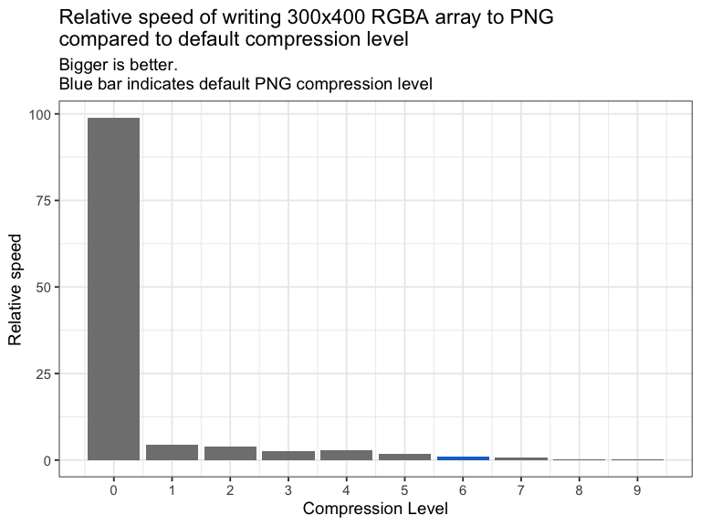

<!-- README.md is generated from README.Rmd. Please edit that file -->

# spng

<!-- badges: start -->

 [](https://github.com/coolbutuseless/spng/actions)
<!-- badges: end -->

`spng` offers in-memory decompression of PNG images to vectors of raw
values.

This is useful if you have bytes representing a PNG image (e.g. from a
database) and need to decompress these to an array representation within
R.

`spng` is a R wrapper for
[libspng](https://github.com/randy408/libspng) - current v0.7.4

- [libspng API docs](https://libspng.org/docs/api/)

## Installation

You can install from [GitHub](https://github.com/coolbutuseless/spng)
with:

``` r
# install.package('remotes')
remotes::install_github('coolbutuseless/spng')
```

## What’s in the box

- `read_png_as_raw(raw_vec, fmt, flags)`

- `read_png_as_nara(raw_vec, flags)`

- `read_png_as_raster(raw_vec, flags)`

- `read_png_as_rgba(raw_vec, flags)`

- `read_png_as_rgb(raw_vec, flags)`

- `get_info(raw_vec)` - interrogate a vector of raw values containing a
  PNG image to determine image information i.e. width, height,
  bit_depth, color_type, compression_method, filter_method,
  interlace_method.

## Example: Decompress a PNG in memory

``` r
library(spng)

#~~~~~~~~~~~~~~~~~~~~~~~~~~~~~~~~~~~~~~~~~~~~~~~~~~~~~~~~~~~~~~~~~~~~~~~~~~~~~
# A PNG file everyone should have!
#~~~~~~~~~~~~~~~~~~~~~~~~~~~~~~~~~~~~~~~~~~~~~~~~~~~~~~~~~~~~~~~~~~~~~~~~~~~~~
png_file <- system.file("img", "Rlogo.png", package="png")
img <- magick::image_read(png_file)
img
```


``` r
#~~~~~~~~~~~~~~~~~~~~~~~~~~~~~~~~~~~~~~~~~~~~~~~~~~~~~~~~~~~~~~~~~~~~~~~~~~~~~
# Read in the raw bytes
#~~~~~~~~~~~~~~~~~~~~~~~~~~~~~~~~~~~~~~~~~~~~~~~~~~~~~~~~~~~~~~~~~~~~~~~~~~~~~
png_data <- readBin(png_file, 'raw', n = file.size(png_file))
png_data[1:100]
#>   [1] 89 50 4e 47 0d 0a 1a 0a 00 00 00 0d 49 48 44 52 00 00 00 64 00 00 00 4c 08
#>  [26] 06 00 00 00 9b 1d 12 0f 00 00 00 06 62 4b 47 44 00 ff 00 ff 00 ff a0 bd a7
#>  [51] 93 00 00 00 09 70 48 59 73 00 00 2e 23 00 00 2e 23 01 78 a5 3f 76 00 00 00
#>  [76] 07 74 49 4d 45 07 d5 02 10 10 08 0e 97 b9 27 bc 00 00 20 00 49 44 41 54 78
```

``` r
#~~~~~~~~~~~~~~~~~~~~~~~~~~~~~~~~~~~~~~~~~~~~~~~~~~~~~~~~~~~~~~~~~~~~~~~~~~~~~
# Get info about the PNG 
#~~~~~~~~~~~~~~~~~~~~~~~~~~~~~~~~~~~~~~~~~~~~~~~~~~~~~~~~~~~~~~~~~~~~~~~~~~~~~
(extract_png_info <- spng::extract_png_info(png_data))
#> $width
#> [1] 100
#> 
#> $height
#> [1] 76
#> 
#> $bit_depth
#> [1] 8
#> 
#> $color_type
#> [1] 6
#> 
#> $compression_method
#> [1] 0
#> 
#> $filter_method
#> [1] 0
#> 
#> $interlace_method
#> [1] 0
#> 
#> $color_desc
#> [1] "RGB + Alpha"
```

### Read PNG as native raster

``` r
nara <- read_png_as_nara(png_data)
grid::grid.raster(nara, interpolate = FALSE)
```



### Read PNG as raster

``` r
ras <- read_png_as_raster(png_data)
plot(ras, interpolate = FALSE)
```


### Read PNG as RGBA array

``` r
arr <- read_png_as_rgba(png_data)
plot(as.raster(arr), interpolate = FALSE)
```


### Read PNG as RGB array

Ignoring any alpha channel in the image.

``` r
arr <- read_png_as_rgb(png_data)
plot(as.raster(arr), interpolate = FALSE)
```


### Read PNG as raw vector

``` r
#~~~~~~~~~~~~~~~~~~~~~~~~~~~~~~~~~~~~~~~~~~~~~~~~~~~~~~~~~~~~~~~~~~~~~~~~~~~~~
# Unpack the raw PNG bytes into RGBA 8-bits-per-color packed format. 
#~~~~~~~~~~~~~~~~~~~~~~~~~~~~~~~~~~~~~~~~~~~~~~~~~~~~~~~~~~~~~~~~~~~~~~~~~~~~~
img_data <- spng::read_png_as_raw(png_data, fmt = spng_format$SPNG_FMT_RGBA8)
img_data[1:200]
#>   [1] 00 00 00 00 00 00 00 00 00 00 00 00 00 00 00 00 00 00 00 00 00 00 00 00 00
#>  [26] 00 00 00 00 00 00 00 00 00 00 00 00 00 00 00 00 00 00 00 00 00 00 00 00 00
#>  [51] 00 00 00 00 00 00 00 00 00 00 00 00 00 00 00 00 00 00 00 00 00 00 00 00 00
#>  [76] 00 00 00 00 00 00 00 00 00 00 00 00 00 00 00 00 00 00 00 00 00 00 00 00 00
#> [101] 00 00 00 00 00 00 00 00 00 00 00 00 00 00 00 00 00 00 00 00 00 00 00 00 00
#> [126] 00 00 00 00 00 00 00 00 00 00 00 00 00 00 00 00 00 00 00 00 00 00 00 00 00
#> [151] 00 00 00 00 00 00 00 00 00 00 c6 c8 c5 01 98 9b 96 13 8f 93 8c 31 87 8b 84
#> [176] 48 83 87 80 5d 81 85 7e 6e 80 84 7d 7c 7e 82 7a 84 81 85 7e 92 7e 83 7b 95
```

## Acknowledgements

- R Core for developing and maintaining the language.
- CRAN maintainers, for patiently shepherding packages onto CRAN and
  maintaining the repository
