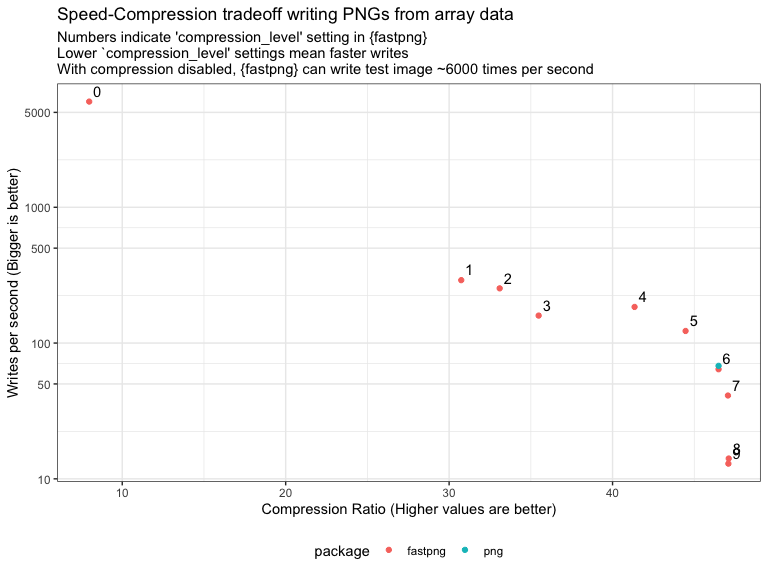

<!-- README.md is generated from README.Rmd. Please edit that file -->

# fastpng

<!-- badges: start -->


[](https://github.com/coolbutuseless/fastpng/actions/workflows/R-CMD-check.yaml)
<!-- badges: end -->

`{fastpng}` provides functions for read/write of PNG image from files
and raw vectors.

By disabling compression when writing image data to PNG, this can be
~75x faster than standard PNG packages.

`{fastpng}`

- Provides explicit support for R images stored as
  - rasters
  - native rasters,
  - numeric arrays (RGBA, RGB, and Grayscale), with values in the range
    \[0,1\]
  - integer arrays (RGBA, RGB, and Grayscale), with values in the range
    \[0, 255\] for 8bit PNGs, and \[0,65535\] for 16bit PNGs
  - indexed images with a palette
  - `raw()` vectors with pixel data in row-major packed pixel format
    e.g. `RGBARGBARGBA...`
- 8-bits-per-colour supported for all image types
- 16-bits-per-colour supported
  - read/write with arrays and raw vectors
  - read into raster, nativeraster (with only 8 bits precision)
- Flags to configure reading of PNG
  - gamma correction
- Flags to configure writing of PNG
  - Compression level
  - PNG filter settings
- Supports specification of single transparent colour for RGB and
  Grayscale images. (Cheap transparency using the `tRNS` PNG chunk)

`fastpng` is an R wrapper for
[libspng](https://github.com/randy408/libspng) - current v0.7.4

- [libspng API docs](https://libspng.org/docs/api/)




## ToDo

- Test reading all PNG formats with `rgba = TRUE` into all R image types

## Installation

You can install from [GitHub](https://github.com/coolbutuseless/fastpng)
with:

``` r
# install.package('remotes')
remotes::install_github('coolbutuseless/fastpng')
```

## What’s in the box

- `read_png()` to read a PNG from a file or a raw vector
- `write_png()` to write data as a PNG file or PNG data in a raw vector
- `get_png_info()` - interrogate a vector of raw values containing a PNG
  image to determine image information i.e. width, height, bit_depth,
  color_type, compression_method, filter_method, interlace_method.
- `test_image` is a named list of different image representations in R:
  RGBA and RGB numeric arrays, raster, native raster.

Supported R image types:

- Native Raster (integer matrix with class ‘nativeRaster’)
- Raster (character matrix with class ‘raster’) with hex colour values
  of the form `#RRGGBBAA` or `#RRGGBB`. Note: R colour names are not
  supported here.
- 3D numeric array containing RGBA values in the range \[0, 1\]
- 3D numeric array containing RGB values in the range \[0, 1\]
- 2D numeric matrix containing greyscale values in the range \[0, 1\]
- Integer 2D matrix paired with a colour palette (specified as a
  character vector of hex colours). Also supports alpha channel.

## Example: Decompress a PNG from a raw vector

``` r
library(fastpng)

#~~~~~~~~~~~~~~~~~~~~~~~~~~~~~~~~~~~~~~~~~~~~~~~~~~~~~~~~~~~~~~~~~~~~~~~~~~~~~
# A PNG file everyone should have!
# Read in the raw bytes
#~~~~~~~~~~~~~~~~~~~~~~~~~~~~~~~~~~~~~~~~~~~~~~~~~~~~~~~~~~~~~~~~~~~~~~~~~~~~~
png_file <- system.file("img", "Rlogo.png", package="png")
png_data <- readBin(png_file, 'raw', n = file.size(png_file))
png_data[1:100]
#>   [1] 89 50 4e 47 0d 0a 1a 0a 00 00 00 0d 49 48 44 52 00 00 00 64 00 00 00 4c 08
#>  [26] 06 00 00 00 9b 1d 12 0f 00 00 00 06 62 4b 47 44 00 ff 00 ff 00 ff a0 bd a7
#>  [51] 93 00 00 00 09 70 48 59 73 00 00 2e 23 00 00 2e 23 01 78 a5 3f 76 00 00 00
#>  [76] 07 74 49 4d 45 07 d5 02 10 10 08 0e 97 b9 27 bc 00 00 20 00 49 44 41 54 78
```

``` r
#~~~~~~~~~~~~~~~~~~~~~~~~~~~~~~~~~~~~~~~~~~~~~~~~~~~~~~~~~~~~~~~~~~~~~~~~~~~~~
# Get info about the PNG 
#~~~~~~~~~~~~~~~~~~~~~~~~~~~~~~~~~~~~~~~~~~~~~~~~~~~~~~~~~~~~~~~~~~~~~~~~~~~~~
(get_png_info <- fastpng::get_png_info(png_data))
#> $width
#> [1] 100
#> 
#> $height
#> [1] 76
#> 
#> $bit_depth
#> [1] 8
#> 
#> $color_type
#> [1] 6
#> 
#> $compression_method
#> [1] 0
#> 
#> $filter_method
#> [1] 0
#> 
#> $interlace_method
#> [1] 0
#> 
#> $color_desc
#> [1] "SPNG_COLOR_TYPE_TRUECOLOR_ALPHA"
#> 
#> $filter_desc
#> [1] "SPNG_FILTER_NONE"
#> 
#> $interlate_desc
#> [1] "SPNG_INTERLACE_NONE"
```

### Read PNG as native raster

``` r
nara <- read_png(png_data, type = 'native_raster')
nara[1:10, 1:10]
#>       [,1] [,2]        [,3]        [,4] [,5] [,6]     [,7]     [,8] [,9] [,10]
#>  [1,]    0    0    -9406092           0    0    0 -8091002 -7695987    0     0
#>  [2,]    0    0    -9340300           0    0    0 -8156795 -7630450    0     0
#>  [3,]    0    0    -9340556    29278912    0    0 -8288124 -7630194    0     0
#>  [4,]    0    0    -9406349   747804820    0    0 -8353917 -7564401    0     0
#>  [5,]    0    0    -9472142  1837534601    0    0 -8485503 -7498608    0     0
#>  [6,]    0    0    -9537678 -1367110777    0    0 -8551296 -7432815    0     0
#>  [7,]    0    0    -9537679  -410941308    0    0 -8682881 -7301229    0     0
#>  [8,]    0    0  -126846604    -8551039    0    0 -8814211 -7235436    0     0
#>  [9,]    0    0  -663651979    -8616832    0    0 -9011590 -7169644    0     0
#> [10,]    0    0 -1317963403    -8617088    0    0 -9143177 -7169643    0     0
grid::grid.raster(nara, interpolate = FALSE)
```


### Write image as indexed PNG

``` r
indices <- test_image$indexed$integer_index
palette <- test_image$indexed$palette

dim(indices)
#> [1] 300 400
indices[1:10, 1:10]
#>       [,1] [,2] [,3] [,4] [,5] [,6] [,7] [,8] [,9] [,10]
#>  [1,]    0    0    0    0    0    0    0    0    0     0
#>  [2,]    0    0    0    0    0    0    0    0    0     0
#>  [3,]    0    0    0    0    0    0    0    0    0     0
#>  [4,]    0    0    0    0    0    0    0    0    0     0
#>  [5,]    0    0    0    0    0    0    0    0    0     0
#>  [6,]    0    0    0    0    0    0    0    0    0     1
#>  [7,]    0    0    0    0    0    0    0    0    1     1
#>  [8,]    0    0    0    0    0    0    0    1    1     1
#>  [9,]    0    0    0    0    0    0    1    1    1     1
#> [10,]    0    0    0    0    0    1    1    1    1     1
palette[1:10]
#>  [1] "#440154FF" "#440256FF" "#450457FF" "#450559FF" "#46075AFF" "#46085CFF"
#>  [7] "#460A5DFF" "#460B5EFF" "#470D60FF" "#470E61FF"
```

    #> NULL


## Acknowledgements

- R Core for developing and maintaining the language.
- CRAN maintainers, for patiently shepherding packages onto CRAN and
  maintaining the repository
