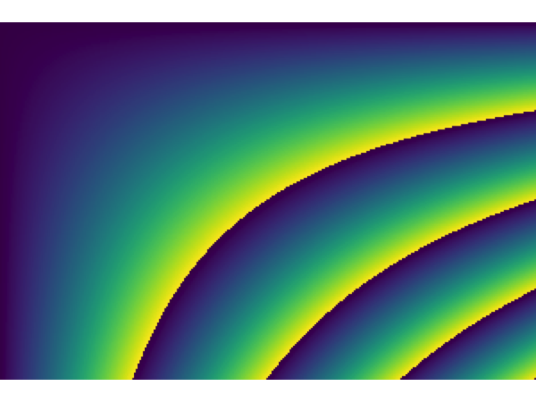

<!-- README.md is generated from README.Rmd. Please edit that file -->

# fastpng

<!-- badges: start -->


[](https://github.com/coolbutuseless/fastpng/actions/workflows/R-CMD-check.yaml)
<!-- badges: end -->

`{fastpng}` reads and writes PNG images.

`{fastpng}` exposes configuration options so that the user can make a
trade-off between speed and size. These options include:

- Compression level
- Filter use
- Image transposition

For example, writing uncompressed PNG images can be 100x faster than
writing with regular compression settings.

`fastpng` is an R wrapper for
[libspng](https://github.com/randy408/libspng) - current v0.7.4

## Features

### Supported image data in R

Supported images each have examples in the `test_image` as part of this
package.

- Native rasters
- Rasters
  - With hex colour formats: \#RGB, \#RGBA, \#RRGGBB, \#RRGGBBAA
  - Standard R colour names also supported e.g. ‘red’, ‘white’
- Numeric arrays
  - Values in range \[0,1\]
  - 1-, 2-, 3- and 4-plane numeric arrays (interpreted as gray,
    gray+alpha, RGB and RGBA images)
- Integer arrays
  - Values in range \[0,255\] treated as 8-bit values
  - Values in range \[0,65535\] treated as 16-bit for PNG writing
- Integer matrix + an indexed palette of colours
- Raw vectors with a specification for data layout

### Supported PNG image types

- 8-bit and 16-bit PNGs
- RGBA, RGB, Gray + Alpha, Gray PNGs
- Indexed colour PNGs
- RGB PNGs with a specified transparency colour (using [tRNS
  chunk](https://www.w3.org/TR/PNG-Chunks))

### Comparison to standard `{png}` library

|                            | `{fastpng}` | `{png}` |
|:---------------------------|-------------|---------|
| Numeric arrays             | Yes         | Yes     |
| Native rasters             | Yes         | Yes     |
| Rasters                    | Yes         |         |
| Integer Arrays             | Yes         |         |
| Indexed PNGs               | Yes         |         |
| `tRNS` transparency        | Yes         |         |
| Configurable compression   | Yes         |         |
| Configurable filtering     | Yes         |         |
| Configurable transposition | Yes         |         |

## Compression Settings: Speed / size tradeoff

<details>
<summary>
Click to reveal benchmark code and results table
</summary>

``` r
library(png)
im <- test_image$array$rgba

res <- bench::mark(
  fastpng::write_png(im, compression_level =  0),
  fastpng::write_png(im, compression_level =  1),
  fastpng::write_png(im, compression_level =  2),
  fastpng::write_png(im, compression_level =  3),
  fastpng::write_png(im, compression_level =  4),
  fastpng::write_png(im, compression_level =  5),
  fastpng::write_png(im, compression_level =  6),
  fastpng::write_png(im, compression_level =  7),
  fastpng::write_png(im, compression_level =  8),
  fastpng::write_png(im, compression_level =  9),
  check = FALSE,
  relative = FALSE
)

res <- res %>% 
  select(writes_per_second = `itr/sec`) %>%
  mutate(
    compression = 0:9,
    package = "fastpng"
  )


sizes <- vapply(0:9, \(x) fastpng::write_png(im, compression_level = x) |> length(), integer(1))
df <- data.frame(compression = 0:9, size = sizes)


plot_df <- left_join(res, df, by = 'compression')


png_speed <- bench::mark(writePNG(im))$`itr/sec`
png_size  <- length(writePNG(im))

plot_df <- plot_df %>% 
  add_row(writes_per_second = png_speed, size = png_size, package = "png") %>%
  mutate(
    compression_ratio = prod(dim(im)) * 8 / size
  )

knitr::kable(plot_df)
```

| writes_per_second | compression | package |   size | compression_ratio |
|------------------:|------------:|:--------|-------:|------------------:|
|        6075.44521 |           0 | fastpng | 240651 |          7.978359 |
|         291.82937 |           1 | fastpng |  62456 |         30.741642 |
|         252.59418 |           2 | fastpng |  58017 |         33.093748 |
|         156.60974 |           3 | fastpng |  54119 |         35.477374 |
|         181.83016 |           4 | fastpng |  46436 |         41.347231 |
|         121.05159 |           5 | fastpng |  43177 |         44.468120 |
|          63.93423 |           6 | fastpng |  41303 |         46.485727 |
|          41.20458 |           7 | fastpng |  40799 |         47.059977 |
|          14.12380 |           8 | fastpng |  40758 |         47.107316 |
|          12.84516 |           9 | fastpng |  40776 |         47.086522 |
|          67.46672 |          NA | png     |  41303 |         46.485727 |

</details>


## Installation

You can install from [GitHub](https://github.com/coolbutuseless/fastpng)
with:

``` r
# install.package('remotes')
remotes::install_github('coolbutuseless/fastpng')
```

## What’s in the box

- `read_png()` to read a PNG from a file or a raw vector
- `write_png()` to write an R image as a PNG file or PNG data in a raw
  vector
- `get_png_info()` - interrogate a vector of raw values containing a PNG
  image to determine image information i.e. width, height, bit_depth,
  color_type, compression_method, filter_method, interlace_method.
- `test_image` is a list of images. These are images contained in
  different datastructures and of differing bitdepth etc: RGBA and RGB
  numeric arrays, raster, native raster.

## Example: Decompress a PNG from a raw vector

``` r
library(fastpng)

#~~~~~~~~~~~~~~~~~~~~~~~~~~~~~~~~~~~~~~~~~~~~~~~~~~~~~~~~~~~~~~~~~~~~~~~~~~~~~
# A PNG file everyone should have!
# Read in the raw bytes
#~~~~~~~~~~~~~~~~~~~~~~~~~~~~~~~~~~~~~~~~~~~~~~~~~~~~~~~~~~~~~~~~~~~~~~~~~~~~~
png_file <- system.file("img", "Rlogo.png", package="png")
png_data <- readBin(png_file, 'raw', n = file.size(png_file))
png_data[1:100]
#>   [1] 89 50 4e 47 0d 0a 1a 0a 00 00 00 0d 49 48 44 52 00 00 00 64 00 00 00 4c 08
#>  [26] 06 00 00 00 9b 1d 12 0f 00 00 00 06 62 4b 47 44 00 ff 00 ff 00 ff a0 bd a7
#>  [51] 93 00 00 00 09 70 48 59 73 00 00 2e 23 00 00 2e 23 01 78 a5 3f 76 00 00 00
#>  [76] 07 74 49 4d 45 07 d5 02 10 10 08 0e 97 b9 27 bc 00 00 20 00 49 44 41 54 78
```

``` r
#~~~~~~~~~~~~~~~~~~~~~~~~~~~~~~~~~~~~~~~~~~~~~~~~~~~~~~~~~~~~~~~~~~~~~~~~~~~~~
# Get info about the PNG 
#~~~~~~~~~~~~~~~~~~~~~~~~~~~~~~~~~~~~~~~~~~~~~~~~~~~~~~~~~~~~~~~~~~~~~~~~~~~~~
(get_png_info <- fastpng::get_png_info(png_data))
#> $width
#> [1] 100
#> 
#> $height
#> [1] 76
#> 
#> $bit_depth
#> [1] 8
#> 
#> $color_type
#> [1] 6
#> 
#> $compression_method
#> [1] 0
#> 
#> $filter_method
#> [1] 0
#> 
#> $interlace_method
#> [1] 0
#> 
#> $color_desc
#> [1] "SPNG_COLOR_TYPE_TRUECOLOR_ALPHA"
#> 
#> $filter_desc
#> [1] "SPNG_FILTER_NONE"
#> 
#> $interlate_desc
#> [1] "SPNG_INTERLACE_NONE"
```

### Read PNG as native raster

``` r
nara <- read_png(png_data, type = 'native_raster')
nara[1:10, 1:10]
#>       [,1] [,2]        [,3]        [,4] [,5] [,6]     [,7]     [,8] [,9] [,10]
#>  [1,]    0    0    -9406092           0    0    0 -8091002 -7695987    0     0
#>  [2,]    0    0    -9340300           0    0    0 -8156795 -7630450    0     0
#>  [3,]    0    0    -9340556    29278912    0    0 -8288124 -7630194    0     0
#>  [4,]    0    0    -9406349   747804820    0    0 -8353917 -7564401    0     0
#>  [5,]    0    0    -9472142  1837534601    0    0 -8485503 -7498608    0     0
#>  [6,]    0    0    -9537678 -1367110777    0    0 -8551296 -7432815    0     0
#>  [7,]    0    0    -9537679  -410941308    0    0 -8682881 -7301229    0     0
#>  [8,]    0    0  -126846604    -8551039    0    0 -8814211 -7235436    0     0
#>  [9,]    0    0  -663651979    -8616832    0    0 -9011590 -7169644    0     0
#> [10,]    0    0 -1317963403    -8617088    0    0 -9143177 -7169643    0     0
```

``` r
grid::grid.raster(nara, interpolate = FALSE)
```


### Write image as indexed PNG

``` r
indices <- test_image$indexed$integer_index
palette <- test_image$indexed$palette

dim(indices)
#> [1] 200 300
```

``` r
indices[1:10, 1:10]
#>       [,1] [,2] [,3] [,4] [,5] [,6] [,7] [,8] [,9] [,10]
#>  [1,]    0    0    0    0    0    0    0    0    0     0
#>  [2,]    0    0    0    0    0    0    0    0    0     0
#>  [3,]    0    0    0    0    0    0    0    0    0     1
#>  [4,]    0    0    0    0    0    0    0    1    1     1
#>  [5,]    0    0    0    0    0    1    1    1    1     1
#>  [6,]    0    0    0    0    1    1    1    1    1     1
#>  [7,]    0    0    0    0    1    1    1    1    1     1
#>  [8,]    0    0    0    1    1    1    1    1    1     1
#>  [9,]    0    0    0    1    1    1    1    1    1     2
#> [10,]    0    0    1    1    1    1    1    1    2     2
```

``` r
palette[1:10]
#>  [1] "#440154FF" "#440256FF" "#450457FF" "#450559FF" "#46075AFF" "#46085CFF"
#>  [7] "#460A5DFF" "#460B5EFF" "#470D60FF" "#470E61FF"
```

``` r
tmp <- tempfile()
write_png(image = indices, palette = palette, file = tmp)
```



## Acknowledgements

- R Core for developing and maintaining the language.
- CRAN maintainers, for patiently shepherding packages onto CRAN and
  maintaining the repository
