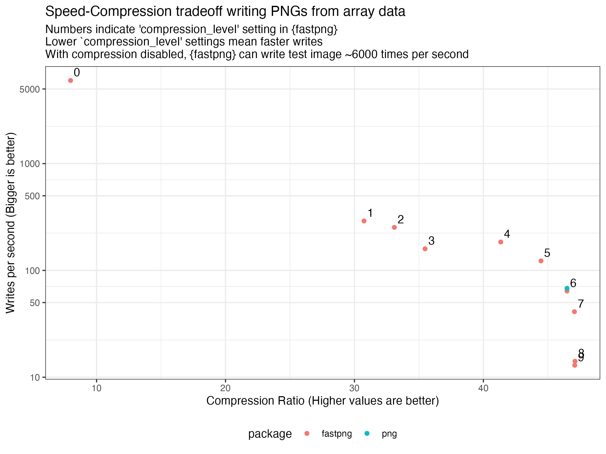

```{r, include = FALSE}
knitr::opts_chunk$set(
  collapse = TRUE,
  comment = "#>"
)
```

```{r setup}
library(fastpng)
```


`{fastpng}` reads and writes PNG images.

`{fastpng}` exposes configuration options so that the user can make a trade-off
between speed of writing and PNG size.  These options include:

* Compression level
* Filter use
* Image transposition

For example, writing uncompressed PNG images can be 100x faster than writing with 
regular compression settings.

`fastpng` uses [libspng](https://github.com/randy408/libspng) - current v0.7.4


## Features 

### Supported image data in R

Supported images each have examples in the `test_image` as part of this package.

* **Native rasters**
* **Rasters**
    * With hex colour formats: #RGB, #RGBA, #RRGGBB, #RRGGBBAA
    * Standard R colour names also supported e.g. 'red', 'white'
* **Numeric arrays**
    * Values in range [0,1]
    * 1-, 2-, 3- and 4-plane numeric arrays (interpreted as gray, gray+alpha,
      RGB and RGBA images)
* **Integer arrays**
    * Values in range [0,255] treated as 8-bit values
    * Values in range [0,65535] treated as 16-bit for PNG writing
* **Integer matrix + an indexed palette of colours** 
* **Raw vectors** with a specification for data layout


### Supported PNG image types

* 8-bit and 16-bit PNGs
* RGBA, RGB, Gray + Alpha, Gray PNGs
* Indexed colour PNGs
* RGB PNGs with a specified transparency colour (using [tRNS chunk](https://www.w3.org/TR/PNG-Chunks))

### Comparison to standard `{png}` library

|             |  `{fastpng}`    |     `{png}`   |
|:------------|-----------------|---------------|
| Numeric arrays              |    Yes        |    Yes       |
| Native rasters              |    Yes        |    Yes       |
| Rasters                     |    Yes        |              |
| Integer Arrays              |    Yes        |              |
| Indexed PNGs                |    Yes        |              |
| `tRNS` transparency         |    Yes        |              |
| Configurable compression    |    Yes        |              |
| Configurable filtering      |    Yes        |              |
| Configurable transposition  |    Yes        |              |


## Compression Settings: Speed / size tradeoff

The following graph shows the speed of writing and the compression ratio 
for various settings in `fastpng`.  A data point for the `png` package 
is also shown.




## Example: Read a PNG into R

```{r fig.height = 2}
library(fastpng)
png_file <- system.file("img", "Rlogo.png", package="png")
fastpng::get_png_info(png_file)

ras <- fastpng::read_png(png_file, type = 'raster') 
grid::grid.raster(ras, interpolate = FALSE)
```


#### Read as a raster (of hex colours)

```{r}
ras <- fastpng::read_png(png_file, type = "raster")
ras[7:11, 79:83]
```

#### Read as a numeric array

```{r}
ras <- fastpng::read_png(png_file, type = "array")
ras[7:11, 79:83, 1] # red channel
```

#### Read as an integer array

```{r}
ras <- fastpng::read_png(png_file, type = "array", array_type = 'integer')
ras[7:11, 79:83, 1] # red channel
```

#### Read as a native raster

```{r}
im <- fastpng::read_png(png_file, type = "nativeraster")
im[7:11, 79:83]
```

## Write an image to PNG with/without compression

```{r}
png_file <- tempfile()
fastpng::write_png(im, png_file)  # standard compression
file.size(png_file)
```

```{r}
fastpng::write_png(im, png_file, compression_level = 0) # no compression, but fast!
file.size(png_file)
```


## Write integer matrix as indexed PNG

```{r}
indices <- test_image$indexed$integer_index
palette <- test_image$indexed$palette

dim(indices)
indices[1:10, 1:10]
palette[1:10]
```


```{r eval=FALSE}
tmp <- tempfile()
fastpng::write_png(image = indices, palette = palette, file = tmp)
```

```{r echo=FALSE, fig.height = 3}
fastpng::write_png(image = indices, palette = palette) |>
  fastpng::read_png() |> 
  grid::grid.raster()
```


